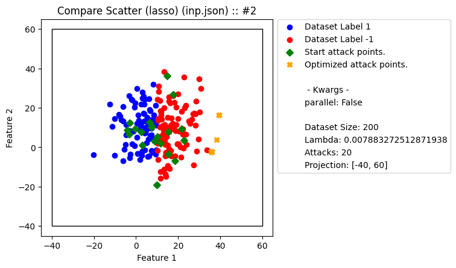

<h1 align="center">Dataset Poisoning</h1>
<h4 align="center">Poisoning datasets using gradient ascent, targeting feature selection.</h4>

<p align="center">
<a href="https://github.com/rpgolota/poisoning/actions?query=workflow%3A%22Code+Test%22"></a>
<a href="https://github.com/rpgolota/poisoning/actions?query=workflow%3A%22Pip+Test%22"></a>
<a href="https://github.com/rpgolota/poisoning/actions?query=workflow%3ALint"></a>
<a href="https://github.com/psf/black"></a>
</p>

<p align="center">
<b><a href="https://rpgolota.github.io/poisoning/build/html/index.html">Documentation</a></b>
</p>

---

### Examples
The following is an example of using xiao2018 to poison a gaussian distribution.


The following is an example of using frederickson2018 to poison a gaussian distribution.



### Installation

You can install poisoning by cloning from this repository, and then installing with pip:

```console
pip install poisoning
```

A shortcut is to run the following command:

```console
pip install git+https://github.com/rpgolota/poisoning/
```

### Get started
```python
import pandas as pd
from poisoning import xiao2018

dataset = pd.read_csv('spect_test.csv', sep=",", header=None)

X = dataset.iloc[:,:-1].values
Y = dataset.iloc[:,-1].values

model = xiao2018(type='elastic')
# poison 10 percent of the dataset, with a boundary box of 0 to 2 for all features
poisoned, labels = model.autorun(X, Y, 0.1, (0,2))
```

##### Windows
If you are on windows, make sure to use a name guard if multiprocessing is enabled (default),

```python
if __name__ == '__main__':
    model = xiao2018()
    ...
```
or disable multiprocessing altogether.
```python
model = xiao2018(parallel=False)
...
```
